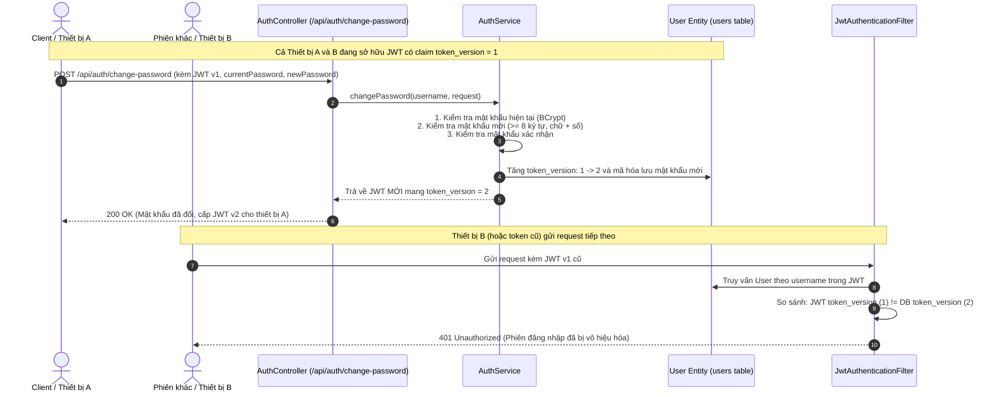

# Hướng dẫn Tính năng Đổi Mật Khẩu và Thu Hồi Phiên Đăng Nhập (Spring Boot)

Dự án triển khai đầy đủ tính năng **Đổi mật khẩu** kết hợp cơ chế **`token_version`** để thu hồi (revoke) toàn bộ phiên đăng nhập / token JWT khác ngay lập tức khi mật khẩu thay đổi.

---

## 1. Cơ chế hoạt động của `token_version`



---

## 2. Cấu trúc thư mục nguồn

- [User.java](file:///c:/Users/Hieu/Downloads/BE/src/main/java/com/example/auth/entity/User.java): Entity chứa trường `token_version` (mặc định khởi tạo `1L`).
- [ChangePasswordRequest.java](file:///c:/Users/Hieu/Downloads/BE/src/main/java/com/example/auth/dto/ChangePasswordRequest.java): DTO xác thực regex: tối thiểu 8 ký tự, bao gồm chữ và số (`^(?=.*[A-Za-z])(?=.*\\d).{8,}$`).
- [ChangePasswordResponse.java](file:///c:/Users/Hieu/Downloads/BE/src/main/java/com/example/auth/dto/ChangePasswordResponse.java): DTO kết quả trả về gồm thông báo, `newTokenVersion` và JWT mới.
- [ApiResponse.java](file:///c:/Users/Hieu/Downloads/BE/src/main/java/com/example/auth/dto/ApiResponse.java): Wrapper chuẩn cho toàn bộ API response.
- [UserRepository.java](file:///c:/Users/Hieu/Downloads/BE/src/main/java/com/example/auth/repository/UserRepository.java): Repository cung cấp `findByUsername` và atomic `incrementTokenVersion`.
- [AuthService.java](file:///c:/Users/Hieu/Downloads/BE/src/main/java/com/example/auth/service/AuthService.java): Interface cho nghiệp vụ đổi mật khẩu & thu hồi phiên.
- [AuthServiceImpl.java](file:///c:/Users/Hieu/Downloads/BE/src/main/java/com/example/auth/service/impl/AuthServiceImpl.java): Xử lý logic nghiệp vụ, tăng `token_version` khi đổi mật khẩu thành công.
- [AuthController.java](file:///c:/Users/Hieu/Downloads/BE/src/main/java/com/example/auth/controller/AuthController.java): Endpoint REST `/api/auth/change-password` và `/api/auth/revoke-sessions`.
- [JwtTokenProvider.java](file:///c:/Users/Hieu/Downloads/BE/src/main/java/com/example/auth/security/JwtTokenProvider.java): Đính kèm `token_version` vào payload JWT và giải mã.
- [JwtAuthenticationFilter.java](file:///c:/Users/Hieu/Downloads/BE/src/main/java/com/example/auth/security/JwtAuthenticationFilter.java): Chặn và so khớp `token_version` trong JWT với DB, từ chối phiên cũ với mã lỗi 401.
- [SecurityConfig.java](file:///c:/Users/Hieu/Downloads/BE/src/main/java/com/example/auth/security/SecurityConfig.java): Cấu hình Spring Security 6 / Spring Boot 3 stateless.
- [GlobalExceptionHandler.java](file:///c:/Users/Hieu/Downloads/BE/src/main/java/com/example/auth/exception/GlobalExceptionHandler.java): Bắt lỗi validation mật khẩu và ném JSON trực quan.

---

## 3. Hướng dẫn Test API qua cURL / Postman

### Bước 1: Đăng nhập để lấy Token ban đầu
Tài khoản mẫu được khởi tạo tự động trong [AuthApplication.java](file:///c:/Users/Hieu/Downloads/BE/src/main/java/com/example/auth/AuthApplication.java): `testuser` / `OldPassword123`.

```bash
curl -X POST http://localhost:8080/api/auth/login \
  -H "Content-Type: application/json" \
  -d '{
    "username": "testuser",
    "password": "OldPassword123"
  }'
```

**Kết quả:** Nhận được JWT mang `tokenVersion = 1` (gọi là `TOKEN_CU`).

---

### Bước 2: Đổi mật khẩu
Gửi yêu cầu tới `/api/auth/change-password` kèm Bearer token:

```bash
curl -X POST http://localhost:8080/api/auth/change-password \
  -H "Content-Type: application/json" \
  -H "Authorization: Bearer <TOKEN_CU>" \
  -d '{
    "currentPassword": "OldPassword123",
    "newPassword": "NewPassword2026",
    "confirmPassword": "NewPassword2026"
  }'
```

**Kết quả thành công (200 OK):**
```json
{
  "success": true,
  "message": "Đổi mật khẩu thành công",
  "data": {
    "message": "Đổi mật khẩu thành công. Tất cả các phiên đăng nhập khác đã bị vô hiệu hóa.",
    "newTokenVersion": 2,
    "newAccessToken": "eyJhbGciOiJIUzI1NiIsInR5cCI6IkpXVCJ9..."
  },
  "timestamp": "2026-09-26T22:45:00"
}
```

---

### Bước 3: Kiểm chứng Thu hồi Phiên (Token cũ bị vô hiệu hóa)
Thử dùng lại `TOKEN_CU` để gửi bất kỳ request nào yêu cầu xác thực:

```bash
curl -X POST http://localhost:8080/api/auth/revoke-sessions \
  -H "Authorization: Bearer <TOKEN_CU>"
```

**Kết quả (401 Unauthorized):**
```json
{
  "success": false,
  "message": "Không có quyền truy cập hoặc phiên đăng nhập đã hết hạn / bị thu hồi"
}
```
> Token cũ ngay lập tức bị từ chối vì `token_version` trong token (1) nhỏ hơn `token_version` trong CSDL (2).
